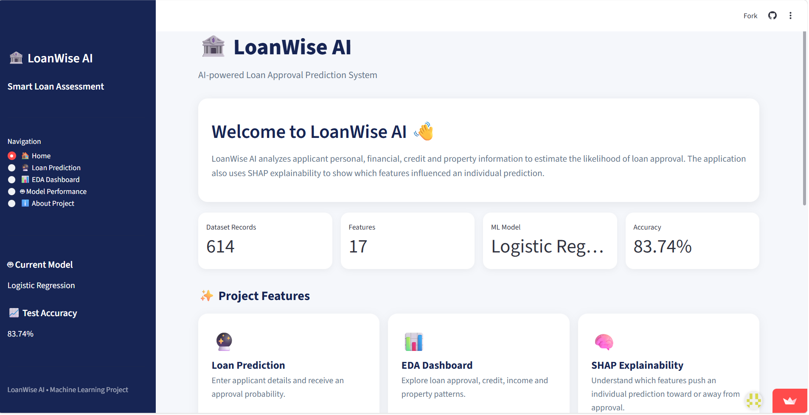
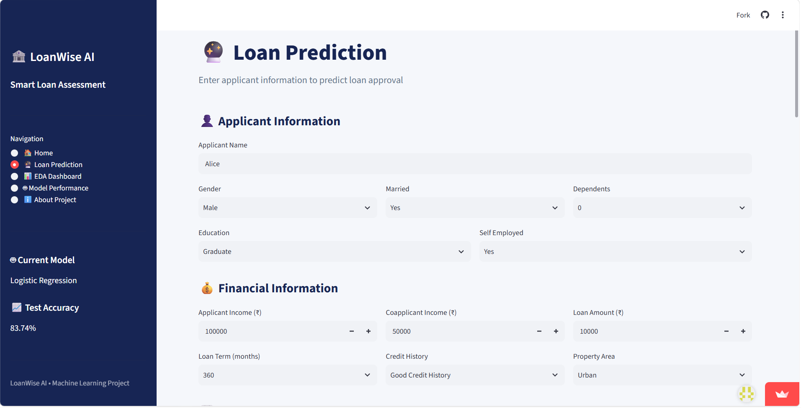
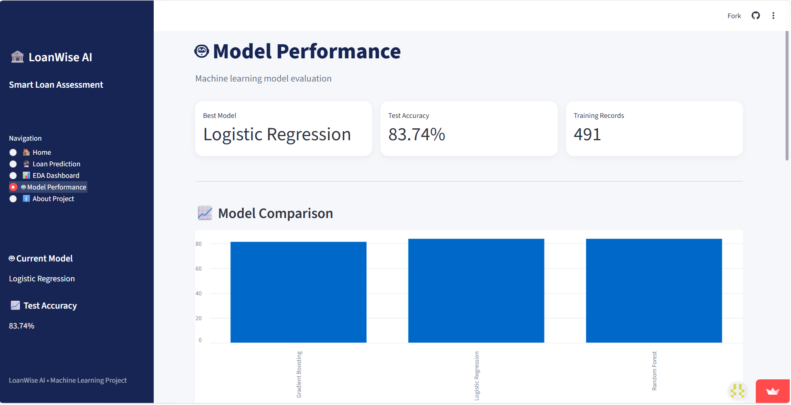

# 🏦 LoanWise AI — Loan Approval Prediction

<p align="center">
  <b>AI-Powered Loan Approval Prediction & Explainable AI Web Application</b>
</p>

<p align="center">
  <a href="https://loanwise-loan-prediction.streamlit.app/">
    🌐 Live Demo
  </a>
  &nbsp; • &nbsp;
  <a href="https://github.com/DokkaChinnari/LoanWise-AI">
    💻 GitHub Repository
  </a>
</p>

---

## 📌 Project Overview

**LoanWise AI** is a Machine Learning based web application that predicts whether a loan application is likely to be **approved or rejected**.

The application analyzes applicant, financial, credit, employment and property information and provides a prediction along with probability scores and model explanations.

Unlike a basic Machine Learning prediction system, LoanWise AI also uses **SHAP Explainable AI** to show which features influenced an individual prediction.

The project is developed using:

- Python
- Pandas
- NumPy
- Scikit-learn
- Logistic Regression
- SHAP
- Matplotlib
- Joblib
- Streamlit

> ⚠️ **Disclaimer:** LoanWise AI is an educational and demonstration project. Its predictions should not be used as an actual banking, lending, financial, or credit decision.

---

## 🚀 Live Demo

### 🌐 Try LoanWise AI Online

👉 **[Open LoanWise AI](https://loanwise-loan-prediction.streamlit.app/)**

The application is deployed using **Streamlit Community Cloud**.

---

## ✨ Key Features

### 🔮 1. Loan Approval Prediction

Users can enter applicant information through an interactive Streamlit interface.

The application accepts:

- Applicant Name
- Gender
- Married Status
- Number of Dependents
- Education
- Self Employed Status
- Applicant Income
- Coapplicant Income
- Loan Amount
- Loan Amount Term
- Credit History
- Property Area

The application provides:

- ✅ Loan Approved / Rejected
- 📈 Approval Probability
- 📉 Rejection Probability
- 📋 Application Summary
- 💡 Prediction Assessment

---

### 💰 2. Applicant & Coapplicant Income

The application considers both applicant and coapplicant income.

The project creates a combined income feature:

```text
Total Income = Applicant Income + Coapplicant Income
```

Coapplicant income provides additional financial information about the loan application and contributes to the overall income considered by the model.

---

### 🧠 3. SHAP Explainability

LoanWise AI uses **SHAP (SHapley Additive exPlanations)** to make individual predictions more understandable.

Instead of simply displaying:

```text
Loan Rejected
```

the application provides information about the features that influenced the model's prediction.

SHAP explainability includes:

- Feature contributions
- Positive factors
- Negative factors
- SHAP values
- Feature contribution visualization

This makes the application an **Explainable AI** project rather than only a prediction system.

---

### ❌ 4. Rejection Assessment

When a loan is rejected, the application provides a short explanation based on the factors influencing the Machine Learning prediction.

Possible factors can include:

- Credit history
- Income level
- Loan amount
- Income-to-loan relationship
- Employment status
- Financial burden
- Property area
- Other engineered model features

> The rejection explanation represents the behavior of the Machine Learning model. It is not an official rejection reason from a bank or financial institution.

---

### 📊 5. EDA Dashboard

The application includes an **Exploratory Data Analysis dashboard**.

The dashboard provides insights into:

- Total applications
- Approved applications
- Rejected applications
- Approval rate
- Loan status distribution
- Credit history
- Applicant income
- Coapplicant income
- Loan amount
- Property area

---

### 🤖 6. Model Performance

The application includes a dedicated Model Performance section.

Current deployed application information:

| Metric | Value |
|---|---:|
| Dataset Records | 614 |
| Features | 17 |
| Machine Learning Model | Logistic Regression |
| Test Accuracy | 83.74% |

> Accuracy is based on the project's test split. Model performance can change if the data split, preprocessing, features, or training configuration is changed.

---

### 📋 7. Application Summary

After a prediction, the application displays an application summary.

It includes information such as:

- Applicant Name
- Gender
- Married Status
- Dependents
- Education
- Self Employment
- Applicant Income
- Coapplicant Income
- Total Income
- Loan Amount
- Loan Term
- Credit History
- Property Area

---

# 🧠 Machine Learning Workflow

The project follows an end-to-end Machine Learning workflow:

```text
                    Loan Dataset
                         │
                         ▼
                Data Preprocessing
                         │
                         ▼
               Missing Value Handling
                         │
                         ▼
              Exploratory Data Analysis
                         │
                         ▼
                 Feature Engineering
                         │
                         ▼
              Categorical Encoding
                         │
                         ▼
                 Train/Test Split
                         │
                         ▼
                  Model Training
                         │
                         ▼
                 Model Evaluation
                         │
                         ▼
                 Saved ML Model
                         │
                         ▼
                Streamlit Web App
                         │
                  ┌──────┴──────┐
                  ▼             ▼
              Prediction       SHAP
                             Explanation
```

---

# ⚙️ Feature Engineering

The project creates additional features to provide useful financial information to the Machine Learning model.

## Total Income

```text
TotalIncome = ApplicantIncome + CoapplicantIncome
```

This combines the applicant's income and coapplicant's income.

---

## Income Group

Applicants are categorized according to their total income:

- Low
- Medium
- High
- Very High

---

## Loan Group

Loan amounts are categorized into:

- Small
- Medium
- Large
- Very Large

---

## EMI

An EMI-related feature is created using the requested loan amount and loan term.

```text
EMI = LoanAmount / Loan_Amount_Term
```

---

## Balance Income

The project creates a balance-income feature using total income and the estimated EMI-related value.

```text
BalanceIncome = TotalIncome - (EMI × 1000)
```

---

## Income-to-Loan Relationship

The application also considers the relationship between total income and requested loan amount as part of the engineered financial information.

---

# 🧹 Data Preprocessing

The dataset contains missing values.

Missing values are handled before Machine Learning training.

Examples include:

| Feature | Missing Value Handling |
|---|---|
| Gender | Mode |
| Married | Mode |
| Dependents | Mode |
| Self Employed | Mode |
| Loan Amount | Median |
| Loan Amount Term | Mode |
| Credit History | Mode |

Categorical features are converted into numerical values using encoding before model training.

---

# 🤖 Machine Learning Model

## Logistic Regression

The deployed application uses **Logistic Regression** as the classification model.

Logistic Regression is suitable for binary classification problems.

In this project, the target represents the loan status:

```text
Approved
    OR
Rejected
```

The trained Machine Learning model is saved using **Joblib** and loaded by the Streamlit application.

---

# 📊 Dataset

The project uses the **Loan Prediction Problem Dataset**.

The dataset contains applicant information such as:

| Feature | Description |
|---|---|
| Gender | Applicant gender |
| Married | Marital status |
| Dependents | Number of dependents |
| Education | Education level |
| Self_Employed | Self-employment status |
| ApplicantIncome | Applicant income |
| CoapplicantIncome | Coapplicant income |
| LoanAmount | Requested loan amount |
| Loan_Amount_Term | Loan repayment term |
| Credit_History | Credit history indicator |
| Property_Area | Property location |
| Loan_Status | Loan approval status |

---

# 🛠️ Technologies Used

| Technology | Purpose |
|---|---|
| Python | Programming language |
| Pandas | Data processing |
| NumPy | Numerical operations |
| Scikit-learn | Machine Learning |
| Logistic Regression | Classification |
| Joblib | Model serialization |
| SHAP | Explainable AI |
| Matplotlib | Visualization |
| Streamlit | Web application |
| Git | Version control |
| GitHub | Repository hosting |
| Streamlit Community Cloud | Deployment |

---

# 📂 Project Structure

```text
LoanWise-AI/
│
├── app.py
├── train_model.py
├── train_u6lujuX_CVtuZ9i.csv
├── loan_model.pkl
├── model_info.pkl
├── encoders.pkl
├── requirements.txt
├── .gitignore
└── README.md
```

---

# 📄 Project Files

## `app.py`

Main Streamlit application.

It contains:

- User interface
- Navigation
- Loan prediction
- Approval probability
- Rejection probability
- Application summary
- Rejection assessment
- EDA dashboard
- Model performance
- SHAP explainability

---

## `train_model.py`

Machine Learning training script used for:

- Data preprocessing
- Missing value handling
- Feature engineering
- Categorical encoding
- Model training
- Model evaluation
- Saving trained model artifacts

---

## `train_u6lujuX_CVtuZ9i.csv`

Loan application dataset used for Machine Learning training and analysis.

---

## `loan_model.pkl`

Serialized trained Machine Learning model.

---

## `model_info.pkl`

Stores model-related information and performance details used by the Streamlit application.

---

## `encoders.pkl`

Stores categorical encoding information used for processing prediction inputs.

---

## `requirements.txt`

Contains the Python packages required to run the application.

---

## `.gitignore`

Prevents unnecessary files such as:

- Virtual environments
- Python cache
- Temporary files
- Secrets

from being uploaded to GitHub.

---

# 💻 Run the Project Locally

## 1. Clone the repository

```bash
git clone https://github.com/DokkaChinnari/LoanWise-AI.git
```

---

## 2. Open the project directory

```bash
cd LoanWise-AI
```

---

## 3. Create a virtual environment

For Windows:

```bash
python -m venv venv
```

---

## 4. Activate the virtual environment

### Windows PowerShell

```bash
venv\Scripts\Activate.ps1
```

### Windows Command Prompt

```bash
venv\Scripts\activate
```

---

## 5. Install dependencies

```bash
pip install -r requirements.txt
```

---

## 6. Run the Streamlit application

```bash
python -m streamlit run app.py
```

The application will normally open at:

```text
http://localhost:8501
```

---

# 📦 Requirements

The project requires:

```text
streamlit
pandas
numpy
scikit-learn
joblib
matplotlib
shap
```

Install all dependencies using:

```bash
pip install -r requirements.txt
```

---

# 🌐 Deployment

LoanWise AI is deployed using **Streamlit Community Cloud**.

Deployment flow:

```text
GitHub Repository
        │
        ▼
Streamlit Community Cloud
        │
        ▼
requirements.txt
        │
        ▼
app.py
        │
        ▼
LoanWise AI
        │
        ▼
🌐 Live Web Application
```

### Deployment Configuration

```text
Repository:
DokkaChinnari/LoanWise-AI

Branch:
main

Main File:
app.py
```

### 🌐 Live Application

**https://loanwise-loan-prediction.streamlit.app/**

---

# 📊 Application Pages

## 🏠 Home

The Home page provides:

- Project introduction
- Dataset information
- Model information
- Test accuracy
- Number of features
- Project features
- Machine Learning workflow

---

## 🔮 Loan Prediction

The Loan Prediction page allows users to enter applicant information.

The application returns:

```text
Applicant Details
       ↓
Data Processing
       ↓
Feature Engineering
       ↓
Machine Learning Prediction
       ↓
Approval / Rejection
       ↓
Probability
       ↓
SHAP Explanation
       ↓
Application Summary
```

---

## 📊 EDA Dashboard

The EDA Dashboard provides visual analysis of the loan dataset.

It analyzes:

- Loan status
- Credit history
- Applicant income
- Coapplicant income
- Loan amount
- Property area

---

## 🤖 Model Performance

The Model Performance page displays:

- Selected Machine Learning model
- Test accuracy
- Model information
- Performance details

---

## ℹ️ About Project

The About Project page provides:

- Project objective
- Technologies used
- Machine Learning approach
- Explainable AI information
- Project limitations
- Educational disclaimer

---

# 🧠 SHAP Explainability

## What is SHAP?

**SHAP** stands for:

> **SHapley Additive exPlanations**

SHAP is used to explain how individual features influence a Machine Learning prediction.

For example:

```text
Credit History       → Positive contribution
Total Income         → Positive contribution
Loan Amount          → Negative contribution
```

The actual contributions depend on the applicant's input values and the trained model.

### Positive Contribution

A positive SHAP contribution indicates that the feature pushes the model's output in one direction.

### Negative Contribution

A negative SHAP contribution indicates that the feature pushes the model's output in the opposite direction.

> SHAP explains the behavior of the trained model. It does not prove that a feature causes loan approval or rejection.

---

# 🎯 Project Objectives

The main objectives of LoanWise AI are:

1. Build an end-to-end Machine Learning application.
2. Predict loan approval outcomes.
3. Handle missing data.
4. Process categorical features.
5. Perform feature engineering.
6. Train a classification model.
7. Evaluate model performance.
8. Build an interactive Streamlit interface.
9. Provide approval and rejection probabilities.
10. Implement Explainable AI using SHAP.
11. Create an EDA dashboard.
12. Deploy the application online.

---

# 💡 Why LoanWise AI?

A traditional Machine Learning application might only return:

```text
Loan Rejected
```

LoanWise AI provides additional information:

```text
Prediction
     ↓
Probability
     ↓
Application Summary
     ↓
Rejection Assessment
     ↓
SHAP Explanation
```

This makes the application more transparent and demonstrates the practical use of **Explainable AI**.

---

# ⚠️ Limitations

This project has several limitations:

- It is based on a historical dataset.
- The dataset may not represent every real-world applicant.
- Test accuracy does not guarantee real-world financial accuracy.
- The model should not be used as an actual lending decision system.
- SHAP explanations describe model behavior and not causal relationships.
- Real banking systems require additional financial, legal, regulatory, security and fairness checks.

---

# 🔮 Future Enhancements

Possible improvements include:

- 🔐 User authentication
- 💾 Database integration
- 📄 Downloadable PDF loan reports
- 📧 Email notifications
- 📊 Additional Machine Learning models
- 🔄 Automated model retraining
- ☁️ Cloud model storage
- 📱 Mobile-responsive improvements
- 🎨 Advanced SHAP visualizations
- 📈 Cross-validation
- 📊 Additional evaluation metrics
- 🏦 Integration with banking APIs
- 🔒 Improved application security

---

# 📸 Screenshots

You can add screenshots of your deployed application to make the GitHub repository more professional.

Recommended folder:

```text
screenshots/
│
├── home.png
├── loan_prediction.png
├── approved_result.png
├── rejected_result.png
├── shap_explanation.png
├── eda_dashboard.png
└── model_performance.png
```

After adding the screenshots, include them in the README:

```markdown
## 📸 Screenshots

### 🏠 Home Page



### 🔮 Loan Prediction



### 🧠 SHAP Explainability


### 📊 EDA Dashboard


### 🤖 Model Performance


```

---

# 📈 Project Results

The current deployed version displays:

```text
Dataset Records : 614
Features        : 17
Model           : Logistic Regression
Test Accuracy   : 83.74%
```

The application provides an interactive interface for making predictions and exploring the model.

---

# 🔗 Project Links

### 🌐 Live Application

https://loanwise-loan-prediction.streamlit.app/

### 💻 GitHub Repository

https://github.com/DokkaChinnari/LoanWise-AI

---

# 👩‍💻 Author

## Dokka Chinnari

**B.Tech — Artificial Intelligence and Machine Learning**

GitHub:

https://github.com/DokkaChinnari

---

# ⭐ Support

If you find this project useful or interesting, please consider giving the repository a ⭐ on GitHub.

---

# 🏷️ Keywords

```text
Python
Machine Learning
Artificial Intelligence
Loan Approval Prediction
Loan Prediction
Classification
Logistic Regression
Scikit-learn
Pandas
NumPy
SHAP
Explainable AI
Streamlit
Data Science
EDA
Feature Engineering
GitHub
Streamlit Community Cloud
```